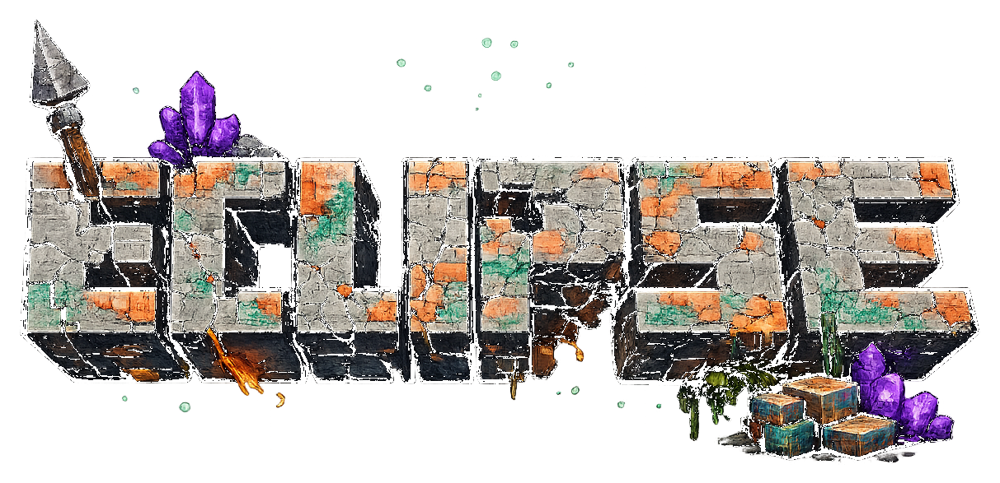
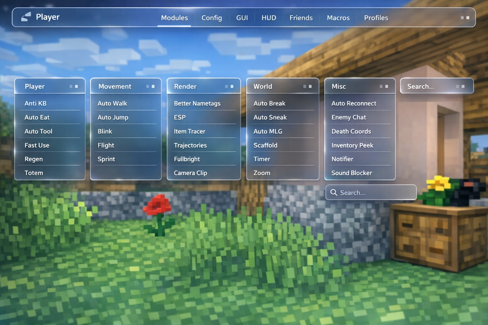

# Eclipse Addon



Современный addon для **Meteor Client** с обновлённым интерфейсом, компактной темой **Eclipse Modern**, доработанным визуалом, cleanup по коду и GitHub-ready структурой.

> **Версия:** `1.0-pre`  
> **Репозиторий:** `https://github.com/leontevova2313-max/Eclipse-addon`  
> **Подготовлено как исходник:** да, это исходный проект со всеми внесёнными фиксами и файлами для GitHub.

## Что вошло в 1.0-pre

- **Eclipse Modern Theme** — строгий компактный UI для Meteor в стиле минималистичных полупрозрачных плиток.
- **Реальная интеграция темы** — тема лежит не мёртвым грузом, а подключается и применяется из кода.
- **Code cleanup** — исправления логики `performanceMode`, меньше хардкодов, безопаснее diagnostics, меньше лишних аллокаций.
- **GitHub-ready репозиторий** — README, changelog, release notes, issue templates, PR template, release checklist.

## Основные категории

- **Combat**
- **Movement**
- **Visuals**
- **Chat**
- **Utility**
- **Network**

## Ключевые изменения по коду

- реально подключена и автоприменяется тема `Eclipse Modern`
- исправлена интеграция темы и импорт `SettingColor`
- выровнена логика `performanceMode` и `adaptivePerformance`
- убран двойной рендер `EclipseToastOverlay`
- убран хардкод `5.0` в `GameRendererMixin`
- убран special-case хардкод сервера из diagnostics
- усилена безопасность snapshot/export в `DiagnosticStore`
- добавлен недостающий `transition_glow.png`
- уменьшены лишние аллокации в части логики `LitematicaPrinter`
- добавлен кэш skin/profile для title screen

Подробности:
- [CHANGELOG.md](CHANGELOG.md)
- [RELEASE_NOTES.md](RELEASE_NOTES.md)
- [MODERN_GUI_NOTES.md](MODERN_GUI_NOTES.md)
- [CODE_REWORK_NOTES.md](CODE_REWORK_NOTES.md)
- [FIXES_APPLIED.md](FIXES_APPLIED.md)
- [docs/TECHNICAL_OVERVIEW.md](docs/TECHNICAL_OVERVIEW.md)

## Визуальное направление



Цель темы:
- компактнее
- строже
- чище
- практичнее
- без грязного blur и перегруза
- с мягкими тенями и аккуратной полупрозрачностью

## Быстрый старт

### Клонирование

```bash
git clone https://github.com/leontevova2313-max/Eclipse-addon.git
cd Eclipse-addon
```

### Сборка

```bash
./gradlew build
```

На Windows:

```bat
gradlew.bat build
```

Готовый jar будет в `build/libs`.

## Публикация релиза

Текущий целевой тег:
- **v1.0-pre**

Файлы для релиза:
- [docs/releases/v1.0-pre.md](docs/releases/v1.0-pre.md)
- [RELEASE_NOTES.md](RELEASE_NOTES.md)
- [RELEASE_BODY_v1.0-pre.md](RELEASE_BODY_v1.0-pre.md)

Ссылка под релиз:
- https://github.com/leontevova2313-max/Eclipse-addon/releases/tag/v1.0-pre

## Локальная проверка

Перед пушем и релизом проверь:
- [docs/LOCAL_BUILD_CHECKLIST.md](docs/LOCAL_BUILD_CHECKLIST.md)
- [docs/RELEASE_CHECKLIST.md](docs/RELEASE_CHECKLIST.md)

## Важно


## License

Смотри [LICENSE](LICENSE).
